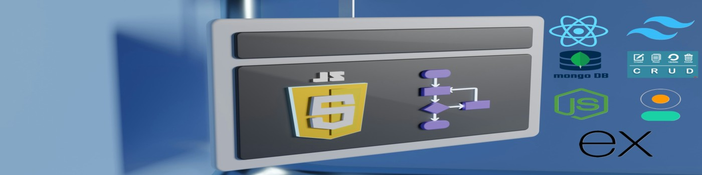

<h1 align="center">Hi 👋, I'm Mahmud Hasan Khan</h1>
<h2 align="center">(Data Scientist | Full-Stack Developer by Passion)</h2>

Greetings! I'm Mahmud Hasan Khan, a B.Sc. Engineer from Bangladesh University of Engineering and Technology (BUET), currently pursuing my M.Sc. in Data Science. I specialize in statistical methods, machine learning, deep learning, and AI using Python and R. I actively use tools and libraries like pandas, scikit-learn, statsmodels, TensorFlow, and Keras to draw insights from data and build predictive models.

I work in the project management team of a power generation company, but my academic journey and passion are deeply rooted in data science and software engineering. As a hobbyist full-stack developer, I enjoy building web applications using the MERN stack (MongoDB, Express.js, React.js, Node.js). Some of my projects include blogging platforms, restaurant management systems, book review sites, real estate portals, and smart ticketing systems.

My transition from engineering to software and data science has not been without challenges. However, driven by an unyielding passion for continuous learning and problem-solving, I strive to merge my analytical mindset with modern technology to build impactful solutions. 

<h3 align="left">Connect with me:</h3>

  
  
  

<h3 align="left">🧠 Data Science & Machine Learning Tools:</h3>

  
  
  
  
  
  
  

<h3 align="left">💻 Full-Stack Development (Hobbyist):</h3>

  
  
  
  
  
  
  
  
  

<h3 align="left">🌱 Currently Exploring:</h3>

  
  
  
  

<h3 align="left">🧰 Tools & Platforms:</h3>

  
  
  
  
  

  

